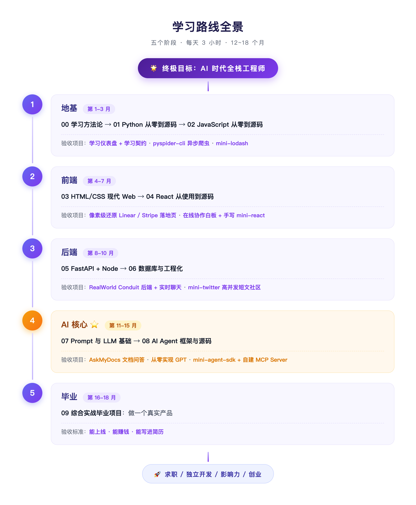
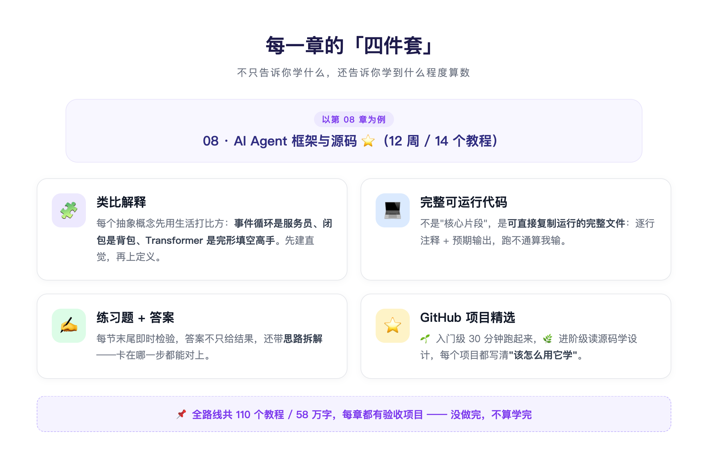
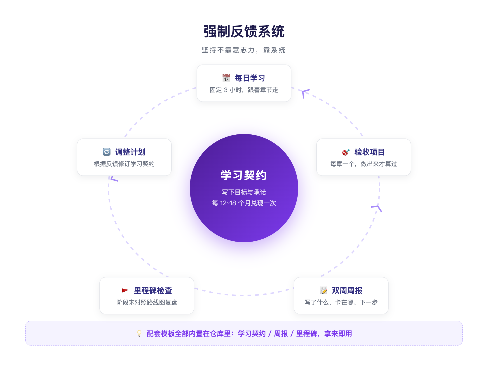

# 58 万字、110 个教程：这份开源的「全栈 + AI Agent」学习路线，写给每一个零基础的人

> 一句话摘要：AI 时代想转行做开发，最怕的不是难，而是"不知道从哪开始"。今天分享一份完全开源的系统化学习路线——**58 万字 / 110 个教程 / 30+ 验收项目**，从零基础一路铺到 AI Agent 全栈工程师，全程免费，拿去就能学。

---

## 💡 为什么做这份路线

先说一个扎心的现实：**AI 没有让学编程变容易，只是让"该学什么"变得更重要了。**

网上最不缺的就是学习资料。B 站搜"Python 入门"有上万个视频，GitHub 上收藏的教程吃灰了几百个。但绝大多数人卡在了同一个地方：

- ❌ **资料是碎的**——今天看个视频，明天刷篇博客，知识点连不成体系
- ❌ **路线是乱的**——学完 Python 该学什么？要不要先学数据结构？没人说得清
- ❌ **反馈是空的**——学了三个月，不知道自己到底"会不会"，直到第一个面试被问倒

这份路线想解决的就是这三件事：**把碎片拼成地图，把"学到什么程度"变成可验收的项目，把坚持变成一套有反馈的系统。**

它不是链接清单，而是一套完整的教程包：

- 📘 **110 个 Markdown 文件 / 58 万字**，每个新概念都用日常类比讲清楚
- 💻 **完整可运行代码**，不是片段，是逐行注释 + 预期输出 + 练习答案
- 🎯 **30+ 章节验收项目**，每章必做一个，没做完不算学完
- ⭐ **400+ 精选 GitHub 项目**，每个都标注"该怎么用它学"
- 🗺️ **Obsidian Canvas 思维导图**，全局视图一目了然

---

## 🗺️ 路线长什么样：五个阶段，12~18 个月

整条路线按"地基 → 前端 → 后端 → AI 核心 → 毕业"五个阶段推进，每天投入 3 小时，周期 12~18 个月：

**阶段一 · 地基（1-3 月）**：学习方法论 → Python → JavaScript。先解决"怎么学"，再动手写第一行代码。

**阶段二 · 前端（4-7 月）**：HTML/CSS → React。验收项目是像素级还原 Linear / Stripe 的落地页，以及一个在线协作白板 + 手写 mini-react。

**阶段三 · 后端（8-10 月）**：FastAPI / Hono → 数据库。验收项目是 RealWorld 全功能后端 + 实时聊天。

**阶段四 · AI 核心（11-15 月）**：Prompt 与 LLM 基础 → AI Agent 框架与源码 ⭐。你会做出自己的 `AskMyDocs` 文档问答、从零实现一个 GPT，最后手写 `mini-agent-sdk` + 自建 MCP Server。

**阶段五 · 毕业（16-18 月）**：做一个**能上线、能赚钱、能写进简历的产品**，然后走向求职、独立开发或创业。

注意一个细节：**每个阶段的名字后面都挂着"验收项目"。** 这是整份路线最核心的设计——

---

## 📚 每一章里到底有什么

很多"学习路线"只告诉你学什么，不告诉你学到什么程度算数。这份路线的答案是**四件套**：

**1️⃣ 类比解释。** 每个抽象概念都先用生活里的东西打比方——事件循环是餐厅服务员、闭包是随身携带的背包、Transformer 是完形填空高手。先建立直觉，再上严谨定义。

**2️⃣ 完整可运行代码。** 不是"核心片段"，是可以直接复制运行的完整文件，逐行注释 + 预期输出，跑不通算我输。

**3️⃣ 练习题 + 答案。** 每节末尾有练习，答案不是只有结果，还带思路拆解。

**4️⃣ GitHub 项目精选。** 每章一份精选清单，分 🌱 入门级（30 分钟跑起来）和 🌿 进阶级（读源码学设计），并且写清楚"这个项目该怎么用来学"。

再加上贯穿全程的**强制反馈系统**：学习契约、周报模板、里程碑检查点——每两周逼自己复盘一次，防止"假装在努力"。

---

## 🧭 怎么用这份路线

**方式一：用 Obsidian 打开（推荐 ⭐）**

1. 下载 [Obsidian](https://obsidian.md/)（免费）
2. `git clone` 仓库到本地
3. 在 Obsidian 中"Open folder as vault"
4. 先打开 `🗺️学习路线思维导图.canvas` 看全局，再从 `00-学习方法论` 开始

**方式二：直接在 GitHub 浏览**

进入 `全栈学习路线/` 文件夹按章节阅读，中文文件名在 GitHub 上显示完全正常。

三条使用建议：

- **别跳章。** 路线是按依赖关系排的，跳过"学习方法论"直接学 Python 的人，大概率在第三周放弃。
- **验收项目是底线。** 每章的项目做不出来，就不要往下走——这不是拖延，是保护。
- **用周报骗不了自己。** 每两周写一次学习周报，写不出内容的两周，就是没学的两周。

---

## ❓ 常见问题

**Q：真的完全免费吗？**
A：是的。整个仓库以 **CC BY-SA 4.0** 协议开源，随便看、随便转、随便印出来贴墙上。

**Q：零基础真的能跟下来吗？**
A：路线就是为零基础设计的，不需要任何前置知识。真正的门槛只有一个：**每天 3 小时，坚持 12 个月以上。** 路线能降低迷路概率，但代替不了你敲键盘。

**Q：12~18 个月会不会太久了？**
A：对比一下常见情况：自学半年还在"收藏 → 吃灰"循环里，什么都没做出来。慢一点的确定性，远快于原地打转。而且每个阶段的验收项目都能单独写进简历，中途也有产出。

**Q：我已经会写代码了，还需要从头看吗？**
A：不需要。每章独立成篇，可以直接跳到你薄弱的阶段。比如老后端想补 AI Agent，直接从 07、08 章切入。

---

## 📌 一句话总结

**这份路线 = 把"零基础到 AI Agent 全栈工程师"这条路，从探险模式改成了导航模式。** 地图、路标、加油站、检查点全都放好了——你只需要发动引擎。

AI 时代最大的红利，属于"既懂工程、又懂 AI"的人。而通往那里的路，现在有了清晰的路标。

---

## 🔗 相关链接

- GitHub 仓库：`github.com/Karovia/fullstack-ai-agent-roadmap`（后台回复「**路线**」获取直达链接）
- Obsidian 官网：https://obsidian.md/

---

*如果这篇文章对你有帮助，欢迎**点赞、在看、转发**三连支持 🙌 关注我们，后台回复「路线」获取完整学习地图。*
